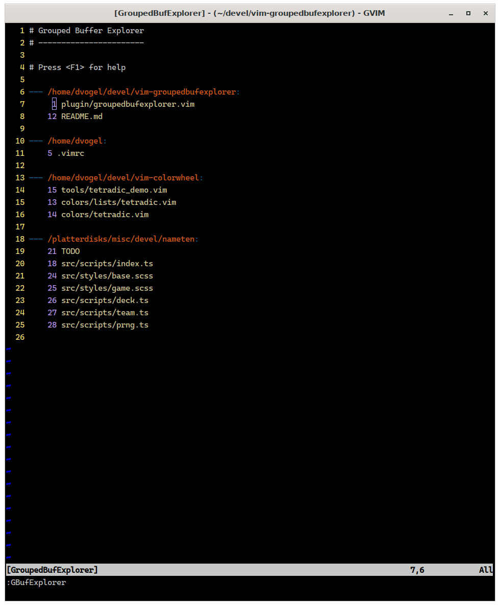

# Vim Plugin: Grouped Buffer Explorer

<a href="screenshot.png"></a>

The plugin has hardcoded key mappings for navigating within it's own buffer. It does not map any keys to launch itself though. For that you will need to map a key sequence to one (or more) of these commands:

* `GBufExplorer`
* `GToggleBufExplorer`
* `GBufExplorerHorizontalSplit`
* `GBufExplorerVerticalSplit`

Years and years and years ago I began using Jeff Lanzarotta's bufexplorer plugin. It's a great plugin that has withstood the test of time. I originally [downloaded it from vim.org](https://www.vim.org/scripts/script.php?script_id=42) and I remember. I don't remember the precise year but I do remember being miffed when it began requiring vim7 because I hadn't yet upgraded. According to Jeff's release notes that puts it sometime before mid 2004. Since then Jeff has also made it available [on github](https://github.com/jlanzarotta/bufexplorer). The way I use vim has changed significantly though too and I decided to rewrite it to suit my own workflow.

You should probably use Jeff's plugin. This one works poorly for people who:

* pop in about out of vim sessions with a handful of files
* primarily use vim within a single project at a time
* organize work by tabs

I tend to use a single long-running gvim session. I leave it open for weeks or even months and I end up working on a dozen projects or more. This plugin groups open buffers and extends the most-recently used buffer sorting to those buffer groups. There are very few options relative to the original.

If you use it you'll likely experience bugs. Sorry about that. Patches welcome :) Since 2004 I've learned to love the cutting edge of vim releases (or even prereleases) and as such this plugin relies on vim9.


The plugin relies on the user to provide a grouping function. By default it will group files by the ddirectory they are in. However I use the [vim-projectroot] plugin to group files by the git working directory they are in. From my `~/.vimrc`:

```
function! GroupFilesByProjectRoot(bufObj)
    let root = projectroot#guess(a:bufObj.name)
    if slice(a:bufObj.name, 0, strcharlen(root)) == root
        let a:bufObj.listname = slice(a:bufObj.name, strcharlen(root) + 1)
        let a:bufObj.groupkey = root
    else
        let a:bufObj.listname = a:bufObj.name
        let a:bufObj.groupkey = defaultGroupKey
    endif
endfunction
let g:GroupedBufExplorerGroupingHook = function('GroupFilesByProjectRoot')
```

The `bufObj` argument is dict with a handful of entries. Most entries come straight from `getbufinfo()`. Some are tweakled slightly:

|key|value|
|---|-----|
|bufnr|Number of the buffer.|
|ftype|Will always be `"file"` because non-files are treated specially.|
|groupkey|Set by you. A string used to group buffers. Displayed above the group.|
|hidden|Boolean indicating whether the buffer is hidden.|
|listed|Boolean indicating whether the buffer is listed.|
|listname|Set by you. A string that will appear on the line for the buffer.|
|loaded|Boolean indicating whether the buffer is loaded.|
|line|The line number of the cursor in the buffer.|
|name|The name of the buffer.|

